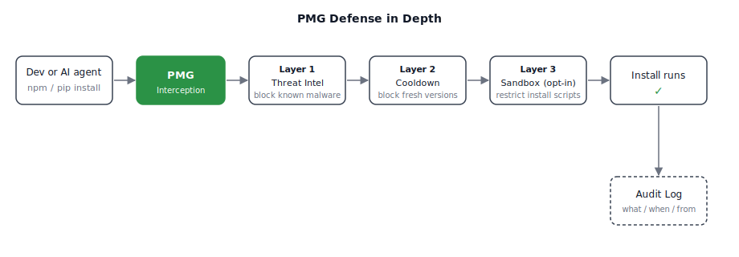

<div align="center">
    <h1>Package Manager Guard (PMG)</h1>
</div>

<p align="center">
    <strong>Block malicious npm and pip packages before they install.</strong><br>
    Defense in depth for the package managers you already use.
</p>

<div align="center">
  
</div>

<br>

<div align="center">

[](https://docs.safedep.io/pmg/quickstart)
[](https://safedep.io)
[](https://discord.gg/kAGEj25dCn)
[](https://tldrsec.com/p/tldr-sec-316)

[](https://goreportcard.com/report/github.com/safedep/pmg)


[](https://api.securityscorecards.dev/projects/github.com/safedep/pmg)
[](https://github.com/safedep/pmg/actions/workflows/codeql.yml)

</div>

## Why PMG?

Developers and AI coding agents install packages every day. Each `npm install` or `pip install` executes thousands of lines of code that nobody reviews.

Recent compromises in popular ecosystems:

- [**Mini Shai-Hulud**](https://safedep.io/mini-shai-hulud-strikes-again-314-npm-packages-compromised/) - 300+ popular packages compromised
- [**litellm 1.82.8**](https://safedep.io/malicious-litellm-1-82-8-analysis/) - a popular AI proxy library compromised to exfiltrate credentials
- [**telnyx 4.87.2**](https://safedep.io/malicious-telnyx-pypi-compromise/) - a legitimate telecom SDK hijacked on PyPI
- [**pino-sdk-v2**](https://safedep.io/malicious-npm-package-pino-sdk-v2-env-exfiltration/) - a typosquat package disguised as the popular pino logger

**PMG is free, open source (Apache 2.0), and requires no account or API key.** It intercepts every package install and checks it against [SafeDep's free community API](https://safedep.io) for known malware **before** code executes. Install it once, and it covers every `npm install`, `pip install`, and `poetry add` after that.

## How PMG Works

PMG takes a defense in depth approach. Zero config, works across Zsh, Bash, and Fish, and each install passes through the enabled protection layers before code runs, plus an audit trail after.

<div align="center">
  <picture>
    <source media="(prefers-color-scheme: dark)" srcset="./docs/assets/how-pmg-works-dark.svg">
    
  </picture>
</div>

<details>
<summary><strong>Layer details</strong></summary>

- **Transparent Interception** - PMG wraps `npm`, `pip`, and other package managers. Developers and AI agents use the same commands. No workflow changes.
- **Layer 1: Threat Intelligence** - PMG checks every package against [SafeDep's real-time threat intelligence](https://safedep.io) before install. Known-malicious packages are blocked. No key, no login required.
- **Layer 2: Policy (Dependency Cooldown)** - PMG blocks package versions published inside a configurable cooldown window, so recently compromised versions are skipped during the window.
- **Layer 3: Opt-in Sandbox** - When sandboxing is enabled and configured, PMG runs installs inside OS-native sandboxes (macOS Seatbelt, Linux Landlock by default, or Bubblewrap fallback) so install scripts have restricted system access even if a threat slips past the first two layers.
- **Audit Logging** - PMG logs every install (what, when, from where) for a verifiable audit trail.

</details>

## How PMG Compares

PMG is the only free, open-source, install-time package firewall that covers developers and AI agents alike and ships with sandboxing and cooldown out of the box.

| Capability                              | PMG | Socket | safe-chain | Snyk | Dependabot |
| --------------------------------------- | --- | ------ | ---------- | ---- | ---------- |
| OSS / built in public                   | ✓   | ✗      | ✓          | ✗    | ✗          |
| No account or API key                   | ✓   | ✓      | ✓          | ✗    | ✗          |
| Install-time malicious package blocking | ✓   | ✓      | ✓          | ✗    | ✗          |
| Dependency cooldown policy              | ✓   | ✗      | ✓          | ✗    | ✗          |
| Runtime sandboxing                      | ✓   | ✗      | ✗          | ✗    | ✗          |
| Protects AI coding agents transparently | ✓   | ✗      | ✗          | ✗    | ✗          |
| Local audit logs                        | ✓   | ✗      | ✗          | ✗    | ✗          |
| Known-CVE remediation PRs               | ✗   | ✗      | ✗          | ✓    | ✓          |

## Quick Start

### 1. Install

```bash
curl -fsSL https://raw.githubusercontent.com/safedep/pmg/main/install.sh | sh
```

> See [Installation](#installation) for Homebrew, npm, and other install methods.

### 2. Setup

Wire PMG into your shell so it intercepts package managers.

```bash
pmg setup install
# Restart your terminal to apply changes
```

> **Tip:** Re-run `pmg setup install` after upgrading PMG to pick up new configuration options.

Validate your installation and verify protection is working:

```bash
pmg setup doctor
```

> **Optional:** PMG inspects HTTPS traffic with an on-the-fly CA that it injects into package
> managers per run. To persist a single CA across runs and trust it in your OS trust store
> (needed for tools that ignore CA environment variables, such as Go on macOS and Windows),
> install it once:
>
> ```bash
> pmg setup cert install          # user scope, no sudo
> pmg setup cert status           # check trust state and expiry
> ```
>
> See [Certificate Authority](docs/cert.md) for scopes, rotation, and removal.

### 3. Use

See PMG blocking threats.

```bash
npm install --no-cache --prefer-online safedep-test-pkg@0.1.3
```

> **Note:** `safedep-test-pkg` is a benign test package flagged as malicious in SafeDep's database for
> testing and verification purposes.

Continue using your package managers as usual, or let your AI coding agent run them. PMG sits in the path, blocking malicious packages.

```bash
npm install express
# or
pip install requests
```

## Supported Package Managers

PMG supports the tools you already use:

| Ecosystem   | Tools    | Command Example     |
| ----------- | -------- | ------------------- |
| **Node.js** | `npm`    | `npm install <pkg>` |
|             | `pnpm`   | `pnpm add <pkg>`    |
|             | `yarn`   | `yarn add <pkg>`    |
|             | `bun`    | `bun add <pkg>`     |
|             | `npx`    | `npx <pkg>`         |
|             | `pnpx`   | `pnpx <pkg>`        |
| **Python**  | `pip`    | `pip install <pkg>` |
|             | `poetry` | `poetry add <pkg>`  |
|             | `uv`     | `uv add <pkg>`      |

## Installation

<details>
<summary><strong>Install Script (MacOS/Linux)</strong></summary>

Downloads the latest release from GitHub, verifies its SHA-256 checksum, and installs to `$HOME/.local/bin` (if on `PATH`) or `/usr/local/bin`.

```bash
curl -fsSL https://raw.githubusercontent.com/safedep/pmg/main/install.sh | sh
```

</details>

<details>
<summary><strong>Homebrew (MacOS/Linux)</strong></summary>

```bash
brew tap safedep/tap
brew install safedep/tap/pmg
```

</details>

<details>
<summary><strong>NPM (Cross-Platform)</strong></summary>

```bash
npm install -g @safedep/pmg
```

> **Note:** NPM-based installs can be fragile when Node.js is managed by version managers like [`mise`](https://mise.jdx.dev/) or [`asdf`](https://asdf-vm.com/). The global `npm` bin path changes with the active Node version, so switching versions can leave `pmg` unavailable on `PATH` (or pointing to an old install). For these setups, prefer the install script or Homebrew.

</details>

<details>
<summary><strong>Go (Build from Source)</strong></summary>

```bash
# Ensure $(go env GOPATH)/bin is in your $PATH
go install github.com/safedep/pmg@latest
```

</details>

<details>
<summary><strong>Binary Download</strong></summary>

Download the latest binary for your platform from the [Releases Page](https://github.com/safedep/pmg/releases).
</details>

## GitHub Actions

Protect CI workflows with one step. PMG analyzes every `npm install`,
`pip install`, etc. in the job.

```yaml
# Consider pinning third-party Actions to a full commit SHA
- uses: actions/setup-node@v6
  with:
    node-version: 24
- uses: safedep/pmg@v1
- run: npm ci
```

By default you get malware blocking and dependency cooldown. Sandbox isolation
is opt-in via the `sandbox` input. Tune behavior via inputs (`paranoid`,
`sandbox`, `cooldown-days`, ...) or point
`config-file` at a YAML in the repo. See
[docs/github-action.md](docs/github-action.md) for the full reference.

## Uninstallation

Remove shell integration:

```bash
pmg setup remove
```

To also remove the PMG configuration file:

```bash
pmg setup remove --config-file
```

Then uninstall PMG itself:

```bash
# Homebrew
brew uninstall safedep/tap/pmg

# NPM
npm uninstall -g @safedep/pmg
```

## Trust and Security

PMG builds are reproducible and signed.

- **Attestations**: GitHub and npm attestations guarantee artifact integrity.
- **Verification**: You can cryptographically prove the binary matches the source code.
- See [Trusting PMG](docs/trust.md) for verification steps.

## User Guide

- [Configuration](docs/config.md)
- [Trusted Packages Configuration](docs/trusted-packages.md)
- [Dependency Cooldown](docs/dependency-cooldown.md)
- [Proxy Mode Architecture](docs/proxy-mode.md)
- [Certificate Authority](docs/cert.md)
- [Sandboxing](docs/sandbox.md)

## Support

If PMG saved you from a bad package, [star this repo](https://github.com/safedep/pmg). It helps others find it.

## Star History

<a href="https://star-history.com/#safedep/pmg&Date">
  <picture>
    <source media="(prefers-color-scheme: dark)" srcset="https://api.star-history.com/svg?repos=safedep/pmg&type=Date&theme=dark" />
    <source media="(prefers-color-scheme: light)" srcset="https://api.star-history.com/svg?repos=safedep/pmg&type=Date" />
    
  </picture>
</a>

## Contributing

Contributions welcome. See [CONTRIBUTING.md](CONTRIBUTING.md) for build and test instructions.

Thank you to all contributors ❤️

<a href="https://github.com/safedep/pmg/graphs/contributors">
  
</a>

## Telemetry

PMG collects anonymous usage data. To disable, either:

- Set `disable_telemetry: true` in your PMG config file, or
- Export `PMG_DISABLE_TELEMETRY=true`.
