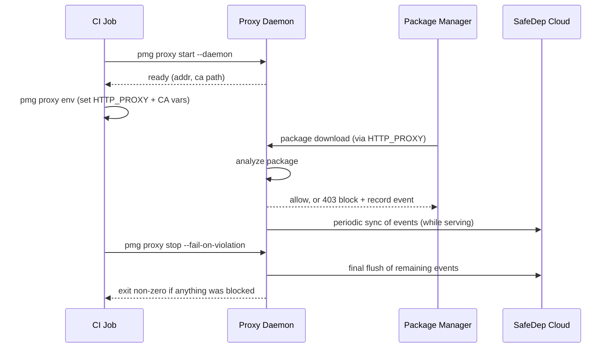

# Persistent Proxy Server

The persistent proxy server runs PMG's MITM proxy as a long-lived process that
intercepts **every** supported package manager invocation in an environment via
standard proxy environment variables, without shims, aliases, or wrapping each
command with `pmg`. It is built for non-interactive environments, primarily
CI/CD pipelines (e.g. GitHub Actions), where the environment can be configured
once for the whole job.

It builds on the generic MITM proxy described in [proxy.md](./proxy.md), reusing
the same interceptor chain, malware analyzer, and certificate manager. The
difference is the **lifecycle**: instead of PMG starting an ephemeral proxy
around a single subprocess, the proxy is started once, advertises itself to the
other `pmg proxy` commands, and serves many package manager processes until it
is stopped.

## Default proxy mode vs. persistent proxy server

PMG's default proxy mode (see [proxy.md](./proxy.md)) wraps a single command.
`pmg npm install` starts an ephemeral proxy, runs `npm` as a child with proxy
env vars injected, then tears the proxy down. The persistent server decouples
these steps.

| | Default proxy mode | Persistent proxy server |
| --- | --- | --- |
| Invocation | `pmg npm install` (wrapped) | bare `npm install` (no wrapper) |
| Proxy lifetime | One subprocess | Until `pmg proxy stop` |
| Who runs the PM | PMG (as a child) | The user / CI directly |
| Ecosystems served | The one being run | All supported (npm + PyPI) |
| Confirmation on malware | Interactive prompt (TTY) | Auto-block (non-interactive) |
| Reporting | At subprocess exit | At `pmg proxy stop` |
| Target | Local dev | CI/CD pipelines |

## How it works

The diagram below shows the order of events in a CI job. The `pmg proxy`
commands run in separate workflow steps and coordinate through the running
daemon.



## Usage

The persistent server targets non-interactive CI/CD. For local development use
the default proxy mode (`pmg npm install`), which keeps the interactive malware
confirmation prompt. The persistent server auto-blocks without prompting.

GitHub Actions (raw commands):

```yaml
- run: pmg proxy start --daemon
- run: pmg proxy env >> "$GITHUB_ENV"
- run: npm ci
- run: pmg proxy stop --fail-on-violation
  if: always()
```

GitHub Actions (via the [safedep/pmg action](../action.yml) `server-mode`):

```yaml
- uses: safedep/pmg@v1
  with:
    server-mode: true
    api-key: ${{ secrets.SAFEDEP_API_KEY }}
    tenant-id: ${{ secrets.SAFEDEP_TENANT_ID }}

- run: npm ci          # intercepted automatically

- name: Enforce PMG policy
  if: always()
  run: pmg proxy stop --fail-on-violation
```

In `server-mode`, the action starts the daemon and injects env vars instead of
installing shims. Because composite actions cannot run an automatic cleanup
step, the final `pmg proxy stop --fail-on-violation` step is required. It stops
the proxy (the daemon flushes events to the cloud during shutdown) and fails the
job on a block.

## Commands

```bash
pmg proxy start    # start the proxy (foreground, or detached with --daemon)
pmg proxy stop     # stop the proxy and report the outcome
pmg proxy env      # print env vars that route package managers through it
pmg proxy status   # report whether a proxy is running
```

Run `pmg proxy <command> --help` for flags. `--daemon` is **Unix only**: on
Windows it returns a clear "not supported" error, and the foreground
`pmg proxy start` still works. To run multiple independent proxies on one host,
give each a distinct `--state` path and `--port`.

## Bind address

The proxy binds `127.0.0.1` on a random port by default, reachable only from the
host (the right choice for CI and local use). Override with `--host`/`--port`, or
the `proxy.server.listen_host`/`listen_port` config (flags take precedence).

Bind a non-loopback address (e.g. `--host 0.0.0.0`) **only** for a deliberately
hosted deployment: it exposes the MITM proxy to the network, and every client
routed through it has its HTTPS intercepted and must trust the PMG CA.

## Certificate trust

The proxy performs TLS MITM, so clients must trust its CA. Trust is delivered
through **environment variables, not the OS trust store**. `pmg proxy env`
always emits the cert-path variables pointing at the proxy's CA bundle:
`NODE_EXTRA_CA_CERTS`, `SSL_CERT_FILE`, `REQUESTS_CA_BUNDLE`, `PIP_CERT`,
`YARN_HTTPS_CA_FILE_PATH`. Package managers pick these up from the job
environment and trust the proxy's CA, with no OS trust-store install required.

This is deliberate: whether a tool consults the OS trust store varies by tool,
version, and config (npm/Node ignore it by default; modern pip can read it;
`requests`/`certifi` ship their own bundle). The cert-path vars work across all
of them, and are harmlessly ignored by tools that do read the OS store.

As a result `pmg setup cert install` is **not** needed for the persistent proxy.
If a persisted CA from `pmg setup cert install` exists the proxy reuses it,
otherwise it generates an ephemeral one. Either way `pmg proxy env` carries the
trust. OS trust-store install (`pmg setup cert install --system`) is
intentionally not used: it needs root (breaking container and locked-down
runners), persistently installs a MITM-capable CA into the machine trust store,
and still does not remove the need for the env vars.

Loopback addresses are always excluded from proxying via `NO_PROXY`
(`localhost,127.0.0.1,::1`).

## Cloud event sync

When SafeDep Cloud is enabled, malware-block events must reach the cloud even on
ephemeral CI runners that are destroyed immediately after the job. The daemon
owns delivery: it records each blocked package to a durable local event log as
it happens, syncs pending events to SafeDep Cloud periodically while serving, and
flushes whatever remains on shutdown.

`pmg proxy stop` reports the recorded result (`Synced N event(s) to SafeDep
Cloud`, or a `Cloud sync failed` line). A flush failure is surfaced but does not
mask the fail-on-violation exit code.

## Fail on violation

By default `pmg proxy stop` just stops the proxy and exits `0`. Failing the CI
job on a policy violation is opt-in via `--fail-on-violation`.

- It exits non-zero when any package was blocked.
- It **fails closed**. If the daemon shut down without writing a verifiable
  final state (e.g. it crashed), `--fail-on-violation` also fails, because a
  security gate must not pass on an unverifiable run.

The package manager's own non-zero exit (from the `403` on a blocked download)
is a separate signal. `--fail-on-violation` gives an authoritative gate from the
proxy regardless of how the package manager reported the failure.

## Limitations

- **Unix-only daemon.** `--daemon` is not supported on Windows (foreground mode
  works).
- **Non-interactive only.** There is no interactive confirmation; flagged
  packages are always auto-blocked. This is intentional for CI.
- **Single proxy per state file.** Starting a second proxy that points at the
  same state file is refused while one is running.
- **System-level trust enforcement is out of scope.** The server relies on env
  var propagation. Enforcing interception for `sudo`-scrubbed environments (e.g.
  via `iptables`) and system-wide install (`pmg setup install --system`) are
  tracked separately.

## References

- [proxy.md](./proxy.md) is the underlying generic MITM proxy server
- [config.md](./config.md) is the configuration schema (cloud, proxy, cache dir)
- [action.yml](../action.yml) is the PMG GitHub Action (`server-mode`)
